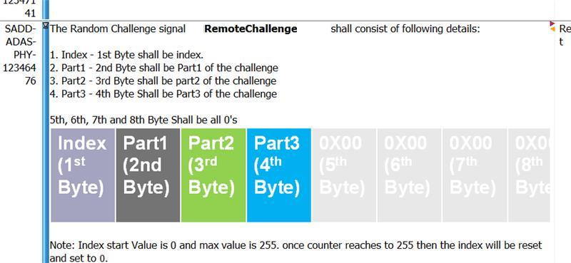

## Version: 0.0.17


## <a href="dataStructure"/>TCP Transmission Structure

* convey length of Header and length of body being transmitted, followed by [Header](#Header) contents and Body contents.
* Body is described by each of the other signals following Header.

**Type** : READ / WRITE

**Body** :
```
Four bytes indicating Header length
Four bytes indicating Body length
Header
Body
```

**Example Transmission** :  
```
00260047{"group":"vehicle_status"}{"status_code":9991234,"status_text":"Example text"}  
```
Header (example length is 26): {"group":"vehicle_status"}  
Body (example length is 52): {"status_code":9991234,"status_text":"Example text"}  


---
# <a href="Header"/>[Header](Header.json)

* provide signal name, identifying type of data being transmitted

**Type** : READ / WRITE

**Structure** :
```json
{
    "group" : String       // Signal name
}
```


---
---
# HANDSHAKE START
# <a href="get_api_version"/>get_api_version

* request version of this API being used in the vehicle so we can accommodate.

**Type** : WRITE

**Body** : NONE

**Success Response** : [vehicle_api_ver](#vehicle_api_ver)

**Error Response** : [vehicle_status](#vehicle_status) will return any failure status code(s).


---
# <a href="vehicle_api_version"/>[vehicle_api_version](read/vehicle_api_version.json)

* inform the mobile device of the version of this API being used in the vehicle so we can accommodate.

**Type** : READ

**Body** :
```json
{
    "api_version" : String         // current version of this api in the vehicle TCU
}
```


---
# HANDSHAKE END
---
# <a href="vehicle_status"/>[vehicle_status](read/vehicle_status.json)

* inform the mobile device of the vehicle status.
* sent ad hoc - vehicle requires no trigger from the mobile device to send this signal.
* may also be requested using [get_vehicle_status](#get_vehicle_status).
* always sent via the VDC but may originate from the NFSM or the VDC.
* each subset of signals will only return one signal in a response.
* status code of (x00) indicates no issues for that subset of signals.
* if all subsets reflect an x00 value, the vehicle has no issues.
* [Vehicle Status Codes](Vehicle_Status_Codes.md)

**Type** : READ

**Body** :
```json
{
    "status_1xx" : {
        "status_code" : Integer,
        "status_text" : String      // any details or description
    },
    "status_2xx" : {
        "status_code" : Integer,
        "status_text" : String      // any details or description
    },
    "status_3xx" : {
        "status_code" : Integer,
        "status_text" : String      // any details or description
    },
    "status_4xx" : {
        "status_code" : Integer,
        "status_text" : String      // any details or description
    },
    "status_5xx" : {
        "status_code" : Integer,
        "status_text" : String      // any details or description
    },
    "status_6xx" : {
        "status_code" : Integer,
        "status_text" : String      // any details or description
    },
    "status_7xx" : {
        "status_code" : Integer,
        "status_text" : String      // any details or description
    },
    "status_8xx" : {
        "status_code" : Integer,
        "status_text" : String      // any details or description
    },
    "status_9xx" : {
        "status_code" : Integer,
        "status_text" : String      // any details or description
    }
}
```


---
# <a href="get_vehicle_status"/>get_vehicle_status

* request status of the vehicle.

**Type** : WRITE

**Body** : NONE

**Success Response** : [vehicle_status](#vehicle_status)


---
# <a href="send_pin"/>send_pin

* send PIN to vehicle for validation

**Type** : WRITE

**Body** :
```json
{
    "pin" : String      // SHA256(String value in range 0000-9999)
}
```

**Success / Error Response** : [vehicle_status](#vehicle_status) will return the appropriate code from the 7xx set of [signal values](../vehiclestatuscodes.md).


---
# <a href="mobile_init"/>[mobile_init](write/mobile_init.json)

* inform the vehicle that the mobile device is ready to proceed.

**Type** : WRITE

**Body** :
```json
{
    "terms_accepted" : Boolean  // useless - app should discontinue if terms are not accepted
}
```

**Success Response** : [vehicle_init](#vehicle_init) where "ready" is true.

**Error Response** : [vehicle_init](#vehicle_init) where "ready" is false and the [vehicle_status](#vehicle_status) will return any failure status code(s).


---
# <a href="vehicle_init"/>[vehicle_init](read/vehicle_init.json)

* inform the mobile device whether the vehicle is ready to proceed.

**Type** : READ

**Body** :
```json
{
    "ready" : Boolean,
    "active_maneuver" : Boolean
}
```


---
# <a href="mobile_challenge"/>[mobile_challenge](read/mobile_challenge.json)

* sent at regular intervals to confirm the connection to, and mathematical accuracy of the Remote Device.
* value received will be a String, to be converted into an 64-bit Unsigned Long
  * Unsigned Long should be broken down into 8 unsigned byte values.
  * byte order: (MSB) index, part1, part2, part3, zeroes, zeroes, zeroes, zeroes (based on ARXML packing, for consistency).

**Type** : READ

**Body** :
```json
{
    "packed_bytes" : String          // Unsigned Long containing 8 unsigned bytes, transmitted as a String
}
```

**Byte Packing**:  


---
# <a href="mobile_response"/>[mobile_response](write/mobile_response.json)

* confirm the network connection and validate the mathematical accuracy of the Remote Device.
* sent as a response to [mobile_challenge](#mobile_challenge).
  * value is a 32-bit Unsigned Integer, packed into the Most Significant Bits of an Unsigned Long
  * transmitted as a String
* [How to compute response_to_challenge](challenge_response.md)

**Type** : WRITE

**Body** :
```json
{
    "response_to_challenge" : String        // computed 32-bit value packed in MSB of 64-bit Unsigned Long, transmitted as a String
}
```

**Error Response** : The vehicle will tolerate a limited timeout for responding, and two consecutive calculation failures. In the case of a third failure, it will discontinue operations and send a [vehicle_status](#vehicle_status).


---
# <a href="list_maneuvers"/>list_maneuvers

* discover all maneuvers currently available in the vehicle. This list is based on current sensor data.

**Type** : WRITE

**Body** : NONE

**Success Response** : [available_maneuvers](#available_maneuvers)

**Error Response** : [vehicle_status](#vehicle_status) will return any failure status code(s).


---
# <a href="available_maneuvers"/>[available_maneuvers](read/available_maneuvers.json)

* list of maneuvers based on vehicle capabilities and mode. Park In will only offer maneuvers for spaces the vehicle has found. Park Out will offer all maneuvers.
* boolean for each maneuver indicates its availability.
* default: NFSM-suggested ParkOut maneuver, or user-selected ParkIn maneuver using In-Vehicle-Infotainment.
* continue_exploring: indicates if the completed exploration maneuver is available to continue.

**Type** : READ

**Body** :
```json
{
    "default" : String,                 // * Maneuver Name | blank
    "continue_exploring" : Boolean,	    // false when LMPushPullMnvrAvailRMT = 2
    "maneuvers" : {
        "OutLftFwd" : Boolean,          // Out Left Forward
        "OutLftRvs" : Boolean,          // Out Left Reverse
        "OutRgtFwd" : Boolean,          // Out Right Forward
        "OutRgtRvs" : Boolean,          // Out Right Reverse
        "InLftFwd" : Boolean,           // In Left Forward
        "InLftRvs" : Boolean,           // In Left Reverse
        "InRgtFwd" : Boolean,           // In Right Forward
        "InRgtRvs" : Boolean,           // In Right Reverse
        "NdgFwd" : Boolean,             // Nudge Forward
        "NdgRvs" : Boolean,             // Nudge Reverse
        "StrFwd" : Boolean,             // Straight Forward
        "StrRvs" : Boolean,             // Straight Reverse
        "OutLftPrl" : Boolean,          // Out Left Parallel
        "OutRgtPrl" : Boolean,          // Out Right Parallel
        "InLftPrl" : Boolean,           // In Left Parallel
        "InRgtPrl" : Boolean,           // In Right Parallel
        "RtnToOgn" : Boolean            // Return To Origin
    }
}
```


---
# <a href="get_threat_data"/>get_threat_data

* request data representing physical obstacles (threats) around the vehicle.

**Type** : WRITE

**Body** : NONE

**Success Response** : [threat_data](#threat_data)

**Error Response** : [vehicle_status](#vehicle_status) will return any failure status code(s).


---
# <a href="threat_data"/>[threat_data](read/threat_data.json)

* integer array of spline points, indicating physical obstacles (threats) detected by the vehicle sensors.
* values range from 0 to 19, representing distance from vehicle (0) up to too distant to detect (19).
* first value in array corresponds (approximately) to driver's door and proceeds clockwise [reference image](threat_data.png)

**Type** : READ

**Body** :
```json
{
    "threats" : Array<Integer>  // Array of 32 ints, each ranging from 0-19
}
```


---
# <a href="maneuver_init"/>[maneuver_init](write/maneuver_init.json)

* inform the vehicle of the desired maneuver.

**Type** : WRITE

**Body** :
```json
{
    "maneuver" : String     // "* Maneuver Name"
}
```
[* Maneuver Name - from list of available maneuvers](#available_maneuvers)

**Success Response** : [maneuver_status](#maneuver_status)

**Error Response** : [vehicle_status](#vehicle_status) will return any failure status code(s).


---
# <a href="maneuver_status"/>[maneuver_status](read/maneuver_status.json)

* sent ad hoc - vehicle requires no trigger from the mobile device to send this signal.
* inform the mobile device of the vehicle maneuver state such as confirmed, in progress, canceled, etc.
* statuses are from the 9xx (`Sensing::ManeuverStatus`) set of Vehicle Status [signal values](../vehiclestatuscodes.md)

**Type** : READ

**Body** :
```json
{
    "maneuver" : String,    // "* Maneuver Name" | blank
    "progress" : Integer,   // 0-100 - not currently offered in production
    "status" : Integer      // Sensing::ManeuverStatus Integer (900 series of codes from Vehicle Status Codes)
}
```
[* Maneuver Name - from list of available maneuvers](#available_maneuvers)


---
# <a href="deadmans_handle"/>[deadmans_handle](write/deadmans_handle.json)

* assure the vehicle that the owner is actively and intentionally engaged with the current maneuver execution and the CPU is functioning normally.
* contains fields that require CRC calculation.
* contains one field (dmh_gesture_progress) that is not part of CRC calculation.
* enable_vehicle_motion: if dmh_gesture_progress == 100 and all Implementation Behaviors below are valid, this is true (1), otherwise false (0)
* dmh_gesture_progress: slider widget position percent 0-100
* dmh_horizontal_touch: x touch coordinate within slider widget region - (float value * 10), trimmed to integer, normalized to 0-1000
* dmh_vertical_touch: y touch coordinate within slider widget region - (float value * 10), trimmed to integer, normalized to 0-1000
* crc_value: computed CRC integer based on the above values


* [How to calculate CRC](crc_calculation.md)

**Type** : WRITE

**Body** :
```json
{
    "enable_vehicle_motion" : Boolean,
    "dmh_gesture_progress" : Integer,
    "dmh_horizontal_touch" : Integer,
    "dmh_vertical_touch" : Integer,
    "crc_value" : Integer
}
```

**Implementation Behaviors** :  
***No touch***: dmh_horizontal_touch, dmh_vertical_touch and dmh_gesture_progress each default to 0, no DMH transmission is made.  
***Begin Transmission***: when dmh_gesture_progress > 0, begin transmitting.  
***Debounce***: after dmh_gesture_progress reaches 100, the touch may stray down to 95 without interrupting the maneuver.  
***Vehicle Interrupt***: the Vehicle may issue a pause or interrupt, which should reset the slider to 0 and one last DMH transmission is made.  
***Invalid Slide Speed***: slide completed in < 0.5 seconds or > 5 seconds.  
***Invalid Slide Direction***: user slides backward more than 10% from the farthest forward point slid since slider was last at 0.  
***Invalid Slide Consistency***: slide data points collected do not fulfill these requirements:
* fewer than 1 data points of dmh_gesture_progress within 1-9, inclusive  
* fewer than 3 data points of dmh_gesture_progress within 10-99, inclusive
* more data points in range 1-9 (+1) than in range 10-99  

***Invalid Hold Position***: after dmh_gesture_progress reaches 100 any of the following will reset the slider to 0, interrupt the maneuver and send one last transmission is made:
* user releases the slider or slides below 95  
* touch point strays from the dmh_gesture_progress = 100 position by more than 5% of the slider region. Formula accounting for slide in any direction:  
  * (((deltaX > deltaY) && (|X100 – AppSliderPosX|<= 0.05 * deltaX)) OR ((deltaY > deltaX) && (|Y100 – AppSliderPosY|<= 0.05 * deltaY)))  

**Error Response** : If the vehicle is not prepared to receive this signal, it may be totally ignored or a [vehicle_status](#vehicle_status) will return any failure status code(s).


---
# <a href="end_maneuver"/>end_maneuver

* end current maneuver

**Type** : WRITE

**Body** : NONE

**Error Response** : [vehicle_status](#vehicle_status) will return any failure status code(s).


---
# <a href="cancel_maneuver"/>cancel_maneuver

* cancel current maneuver

**Type** : WRITE

**Body** : NONE

**Error Response** : [vehicle_status](#vehicle_status) will return any failure status code(s).


---
# <a href="cancel_drive_on"/>cancel_drive_on

* if the driver enters the vehicle and triggers certain things (like pressing the brake), the vehicle will enter Drive On mode, suspending RPA. The app should show a message stating as much and offering a Resume Maneuver button.
* clicking Resume Maneuver will send this signal to inform the vehicle to resume RPA.

**Type** : WRITE

**Body** : NONE

**Error Response** : [vehicle_status](#vehicle_status) will return any failure status code(s).


---
# <a href="get_cabin_status"/>get_cabin_status

* request current status of the cabin features.

**Type** : WRITE

**Body** : NONE

**Success Response** : [cabin_status](#cabin_status)

**Error Response** : [vehicle_status](#vehicle_status) will return any failure status code(s).
LMStatus

---
# <a href="cabin_status"/>[cabin_status](read/cabin_status.json)

* convey current status of the cabin features to the Remote Device

**Type** : READ

**Body** :
```json
{
    "power_status" : Integer,           // 0: Key Out, 1: Key Recently Out, 2: Key Approved, 3: Post Accessory, 4: Accessory, 5: Post Ignition, 6: Ignition On, 7: Running, 9: Crank
    "door_open_driver" : Boolean,
    "door_open_passenger" : Boolean,
    "door_open_lr" : Boolean,
    "door_open_rr" : Boolean,
    "door_open_tailgate" : Boolean,
    "door_open_engine_hood" : Boolean,
    "lock_status" : Integer             // 0: Unlocked, 1: Part Locked, 2: Central Locked, 3: Double Locked, 4: TheftProtectNODoubleLock, 5: Unused
}
```


---
# <a href="cabin_commands"/>[cabin_commands](write/cabin_commands.json)

* inform the tcu of the desired cabin feature states

**Type** : WRITE

**Body** :
```json
{
    "engine_off" : Boolean,
    "doors_locked" : Boolean  
}
```

**Success Response** : [cabin_status](#cabin_status)

**Error Response** : [vehicle_status](#vehicle_status) will return any failure status code(s).


---

# Common Use Case:

```plantuml
|||
actor User

User -> mobile_device : open app

== Handshake ==

mobile_device -> tcu : get_api_version
tcu -> mobile_device : vehicle_api_version

== Initialization ==

group repeats if PIN validation fails in Vehicle
  mobile_device -> tcu : send_pin
  tcu -> mobile_device : vehicle_status
end

mobile_device -> tcu : mobile_init
tcu -> mobile_device : vehicle_init

group if maneuver in progress
  tcu -> mobile_device : maneuver_status msg - initiated
end

== THROUGHOUT THE SESSION ==

loop at regular intervals
  tcu -> mobile_device : mobile_challenge
  mobile_device -> tcu : mobile_response
end

group whenever the vehicle has something to say
  tcu -> mobile_device : vehicle_status
end

== Get Maneuvers ==

mobile_device -> tcu : list_maneuvers
mobile_device -> tcu : get_threat_data
...after scanning...
tcu -> mobile_device : available_maneuvers
tcu -> mobile_device : threat_data

== Maneuver Request ==

mobile_device -> tcu : maneuver_init
tcu -> mobile_device : maneuver_status - confirmed

== Execute Maneuver ==

loop while sliding and holding
  mobile_device -> tcu : deadmans_handle
end

== Maneuver Complete ==

tcu -> mobile_device : maneuver_status : Finishing
mobile_device -> tcu : deadmans_handle - position = 0

== Cabin Management ==

mobile_device -> tcu : get_cabin_status
tcu -> mobile_device : cabin_status
mobile_device -> tcu : cabin_commands
tcu -> mobile_device : cabin_status

User -> mobile_device : close app
```


# Maneuver Interrupted by User

```plantuml
...user releases deadmans_handle...
mobile_device -> tcu : deadmans_handle - position = 0
tcu -> mobile_device : maneuver_status : Interrupted
```


# Maneuver Canceled by User

```plantuml
mobile_device -> tcu : cancel_maneuver
tcu -> mobile_device : maneuver_status : Canceled
```


# Maneuver Interrupted or Canceled by Vehicle

```plantuml
group vehicle is in error state
  mobile_device -> tcu !! : deadmans_handle
  note right: ignored
end
tcu -> mobile_device : maneuver_status : Interrupted or Canceled
tcu -> mobile_device : vehicle_status - error
mobile_device -> tcu : deadmans_handle - position = 0
```


# Maneuver Initiated in Vehicle

```plantuml
mobile_device <- tcu : vehicle_status 527 Maneuver selected in vehicle
mobile_device -> tcu : list_maneuvers
tcu -> mobile_device : available_maneuvers
mobile_device -> tcu : maneuver_init - value from ivi_selected_maneuver
...In this scenario, there is no confirmation...
```


# DriveOn

```plantuml
mobile_device <- tcu : vehicle_status 810 DriveOn Initiated
...Possibility 1: user drives on:...
mobile_device <- tcu : vehicle_status 811 DriveOn Engaged
...Possibility 2: user cancels DriveOn:...
mobile_device -> tcu : cancel_drive_on
```
