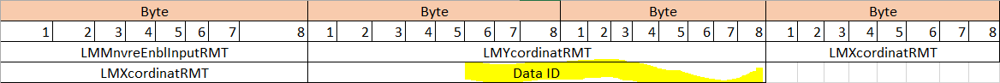

## Version: 0.0.17

# <a href="crc_value"/>crc_value Computation

**Used to** :  
* generate a CRC for the given data set

**Data Type** : Bytes (packed into an array for CRC computation)

**Data** :  
* The CRC is simply a checksum.
  * Given the set of signals we intend to send, we shall take all the signal values, place them in the data structure given below and use the polynomial given below to produce a CRC value.
  * The set of signals is then sent to the vehicle, along with the computed CRC value.
  * In the vehicle, the set of signals (excluding the CRC value) are put into the same structure we used in the app to re-compute the CRC. If they compute the same CRC value as we sent in, all is good. If the values are not equal, the set of signals is discarded as corrupted.
* data_id is an agreed-upon constant 0x482C (which is reversed 0x1234) to be used in the app and the NFS. It is included with the other values during computation but is NOT transmitted.
  
**Signal packing order** :  

| Signal Name | No of Bytes | Position | Publisher | Subscriber |
| --- | --- | --- | --- | --- |
| enable_vehicle_motion (LMMnvreEnblInputRMT) | 1 | 1 | TCU | NFSM |
| dmh_vertical_touch (LMYcordinatRMT) | 2 | 2 | TCU | NFSM |
| dmh_horizontal_touch (LMXcordinatRMT) | 2 | 3 | TCU | NFSM |
| data_id = 0x482C (NOT TRANSMITTED) | 2 | 4 | NONE | NONE |
  

  

**From the [AutoSAR E2E Protocol Specification](https://www.autosar.org/fileadmin/user_upload/standards/foundation/1-3/AUTOSAR_PRS_E2EProtocol.pdf)**
5.6 Specification of E2E Profile 5:

| Control field | Description |
| --- | --- |
| Counter | 8 bits. (explicitly sent)  **We are NOT sending this value** |
| CRC | 16 bits, polynomial in normal form 0x1021 (Autosar notation), provided by CRC library. (explicitly sent) |
| Data Id | 16 bits, unique system-wide. (implicitly sent) |
  
**Simplified Polynomial Specification (CRC-16/AutoSAR-Bosch)**  
 Sample input / output: {‘1’, ‘2’, ‘3’, ‘4’, ‘5’, ‘6’, ‘7’, ‘8’, ‘9’, 0x48, 0x2C}  /  CRC = 27151  

| Parameter | Value |  
| --- | --- |
| CrcPolynomial | Normal(0x1021) |
| crcSize | 16 |  
| initialValue | 0xffff |  
| finalXorValue | 0x0000 |  
| inputReflected | false |  
| resultReflected | false |  
  
**Formula**:  

    # 0x1021 = x^16 + x^12 + x^5 + 1

Formula referenced on Wikipedia here: [Cyclic redundancy check](https://en.wikipedia.org/wiki/Cyclic_redundancy_check) (search for 0x1021)  
and here: [Computation of cyclic redundancy checks](https://en.wikipedia.org/wiki/Computation_of_cyclic_redundancy_checks).  

---
